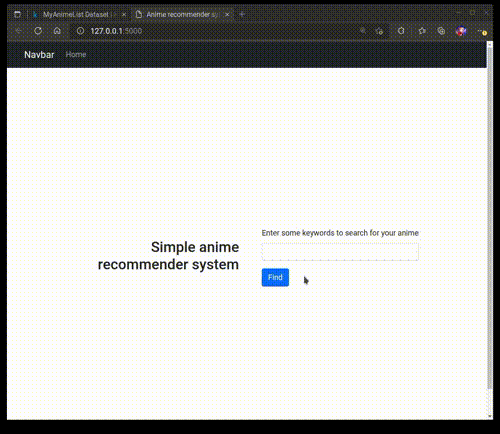

# Anime recommendation system on MAL dataset

This is my first recommendation system using collaborative filtering. I only used `NearestNeighbors` from `sklearn` instead of dedicated libraries like `scikit-surprise` because I wanted to challenge myself a little bit.

Dataset used: [MyAnimeList Dataset](https://www.kaggle.com/datasets/azathoth42/myanimelist).

## Project structure
- `preprocessing`: source files and notebooks to the preprocess original dataset and build the sparse user-movies matrix.
- `web`: a simple Flask application for demonstrating the system.

## How to

1. Download the following files from the above Kaggle dataset
   - `anime_cleaned.csv.zip` 
   - `UserAnimeList.csv.zip`
2. Put them into `preprocessing` folder (do not extract).
3. Run `preprocessing/build.sh`.
4. After building, copy following files to `web/models/`
   - `anime_db.parquet`
   - `movies_index.pkl`
   - `user_anime_pivot.pkl`
5. Run `web/app.py`

Note: the user-anime dataset consists of around 80 million rows, so make sure that you have enough memory to run the build script. It ran fine on my laptop with 16 GB of RAM.

You should also make sure that the Python version for building the dataset and serving the Flask application is the same.

## Short demo

